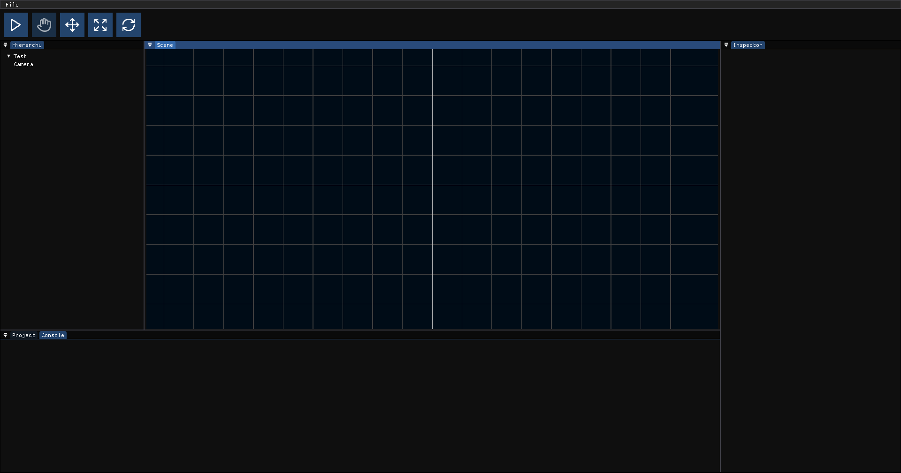

# Game Engine

A lightweight 2D game engine made with libGDX.



## **Features**

- **Java Scripting**
- **Audio**
- **2D Physics (Box2D)**
- **Shaders**

## **Example Script**

```java
import com.gameengine.api.Component;
import com.gameengine.api.Input;
import com.gameengine.api.Time;
import com.gameengine.api.math.Vector2;

public class PlayerController extends Component {

    public float speed = 10;

    private Vector2 tmp = new Vector2();

    public void update() {

        float x = 0, y = 0;

        if (Input.isKeyPressed("W"))
            y = 1;
        if (Input.isKeyPressed("A"))
            x = -1;
        if (Input.isKeyPressed("S"))
            y = -1;
        if (Input.isKeyPressed("D"))
            x = 1;

        tmp.set(x, y).nor();
        tmp.scl(speed).scl(Time.getDeltaTime());

        gameObject.transform.position.add(tmp);

    }

}
```

## **Download**

Find the latest version in the [Releases](https://github.com/0880880/GameEngine/releases) page.

## Requirements

Java Development Kit (JDK): 17 or higher

## **License**

This project is governed by the MIT License. For detailed information, refer to [LICENSE](https://github.com/0880880/GameEngine/blob/core/LICENSE).
